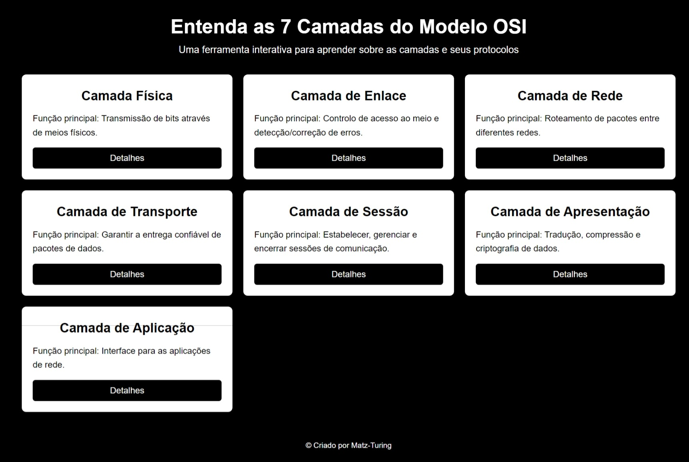
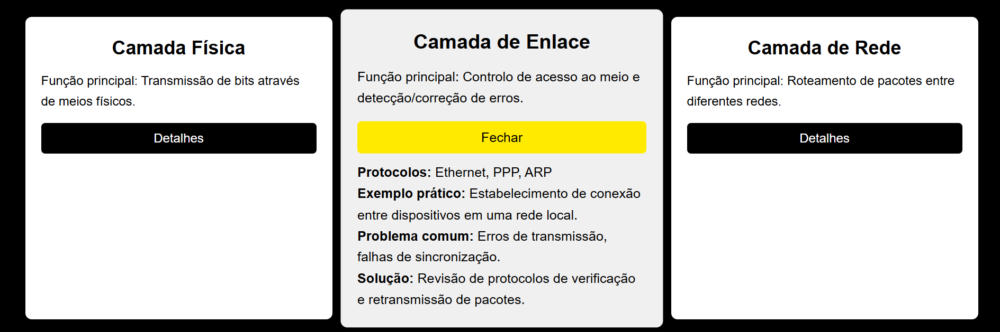

# Ferramenta Interativa das 7 Camadas do Modelo OSI

Este projeto é uma ferramenta educacional interativa que explica detalhadamente as 7 camadas do modelo OSI, oferecendo descrições, protocolos e exemplos práticos de forma envolvente e acessível.

## Imagens

*Acima está uma captura de tela inicial da aplicação.*

*Acima está uma captura de tela detalhada da aplicação com as principais funcionalidades.*

## Tecnologias Utilizadas

- **HTML**: Estrutura e organização dos elementos da interface.
- **CSS**: Estilização e design responsivo para garantir uma experiência visual atraente.
- **JavaScript**: Implementação da interatividade, como cliques nas camadas, animações e exibição dinâmica de informações.

## Funcionalidades

- **Exibição das Camadas**: Exibe as 7 camadas do modelo OSI com seus nomes e funções principais.
- **Exploração Detalhada**: Ao clicar em cada camada, o usuário pode ver uma descrição detalhada, protocolos associados e exemplos práticos.
- **Problemas e Soluções**: Para cada camada, o usuário pode visualizar problemas comuns e soluções recomendadas para cada um.

## Exemplo de Funcionalidade

- **Camada Física**: Explicação sobre a transmissão de bits através de meios físicos como cabos e sinais sem fio.
- **Camada de Enlace**: Detalhes sobre o controle de acesso ao meio e a detecção/correção de erros.
- **Camada de Aplicação**: Exemplo de navegação em sites usando o protocolo HTTP.

## Contribuições

Contribuições são bem-vindas! Se você quiser sugerir melhorias ou adicionar novas funcionalidades, fique à vontade para abrir uma issue ou fazer um pull request.

## Créditos

Desenvolvido por Mateus S.  
GitHub: [Matz-Turing](https://github.com/Matz-Turing)

